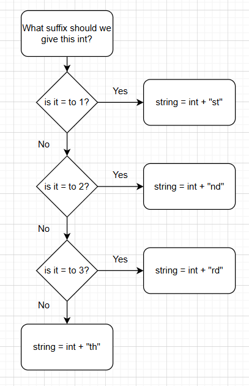
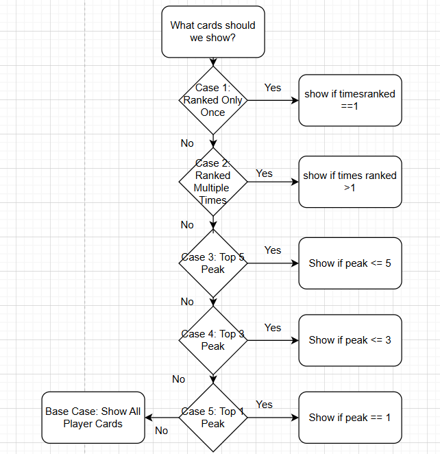

# Decision Tree
## Describe a decision process that you will implement on your product website. It must meet the following requirements: 
- The decision process must have at least three decision nodes.  
- Include a description of each decision node and its branches. 
- Include why each branch is leading to the final decision that it leads to.

I have two separate decision based processes that will occur in my JavaScript file:
- The first has to do with adding the suffix to the peak rank numbers on each player card. These are taken from an array of integer values, ranging from 1 to 10, and the if-else if-else statement will add the correct suffix to the string before it is parsed into the appropriate player card. In this situation, the root node would be the question "What suffix does this integer need?", and the decision nodes would be the questions "does this integer equal 1?", "does this integer equal 2?", and "does this integer equal 3?". Based on what the integer is, it will go down one of these branches, where either it will gain the "st" sufix (==1), the "nd" suffix (==2), the "rd" suffix (==3), or the "th" suffix (else, any other number >4 <=10>). Below is a flowchart diagram of the decision tree. 

- The second is switch case based on the current status of the filter toggle on the player search section. This will only show the player cards that match the certain criteria (All cards by defaut): Only 1 appearance on a PR, multiple appearences on PRs, a peak placement greater than or equal to 5th, a peak placement greater than or equal to 3rd, or a peak placement of 1st. Each switch statement has an if statement to determine which cards get to be shown. Below is a flowchart of the decision tree. 
