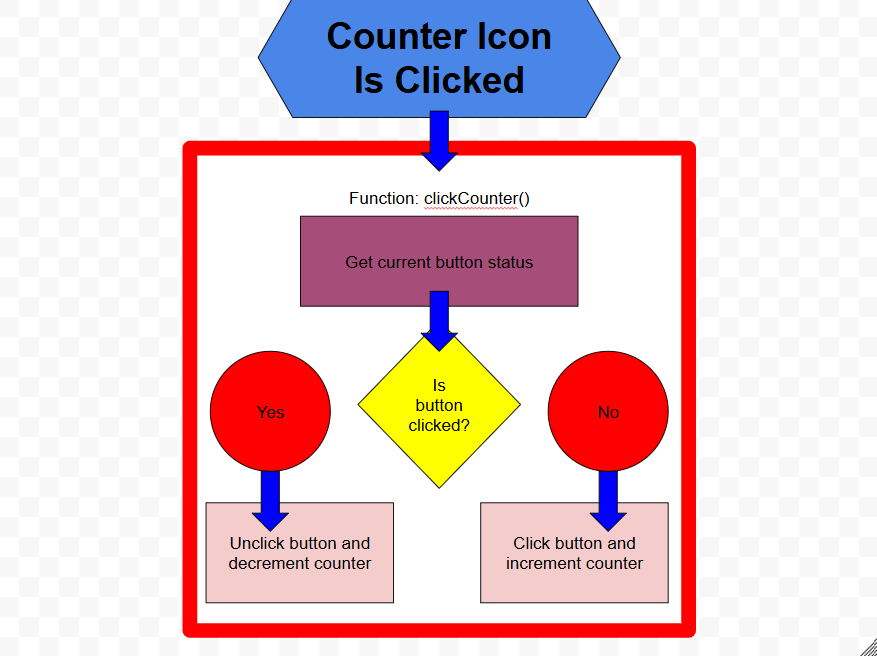

# JavaScript Events

## Describe Your Event

My idea for a JavaScript event handling process will occur on the event series webpage. Each event series will have an icon next to it that users will be able to click to show that they are interested in the event. It will have a counter which will increment/decrement based on whether the button is clicked or not. I may give these events starting values near the average number of entrants they typically get (20 for the URI weeklies, 45 for the URI monthlies, and 60 for Howling IRL events). The code would increment the counter variable within the js file, update the counter visually on the user's screen, and update the image to the checked box/thumbs up (whatever I decide on using). Below is a flowchart of what this will look like. 

## Draw an Event Handling Flowchart
Create a flowchart that visually represents your event-handling process. Use the examples above as a reference. 
Follow these conventions for your diagram:
