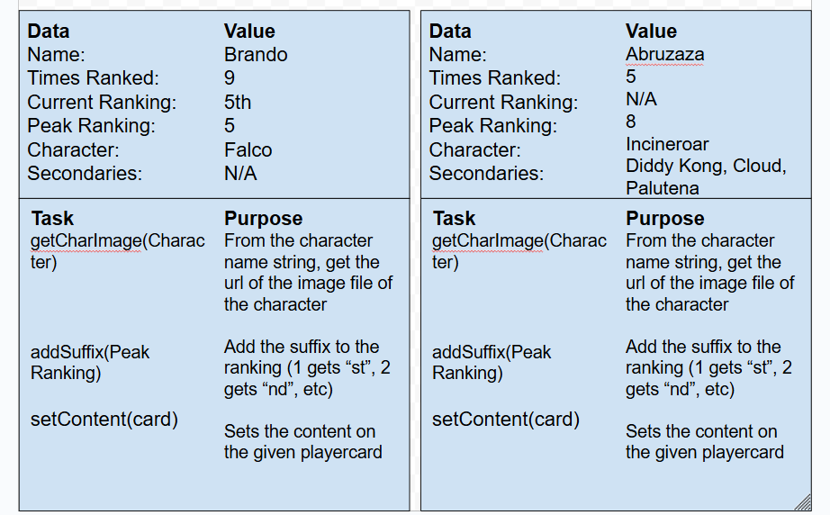

# Objects

## What I Plan On Using Objects For
- I plan on using Objects to remake my player card section on the rankings page. At this time I am unsure just how much of this page's functionality I will move over to the object based js file, called all-rankings-data-v2.js, but I will at least move all of the information about each player to this file. It makes more sense to use objects properties for each player than my current setup, which is separate arrays for individual stat, with elements at the same index between arrays corresponding to the same player. This will make my program more modularized, and potentially allow me to expand the scope of the site with greater ease. One method it would have would be putting the suffix on the place numbers, such as the "st" of "1st". Another would be getCharImage(characterName), which would return the image of the main character of the respective player from the main character string. The final method it would have would be set content, which would set the content on the given playercard.

## Visual Diagram
