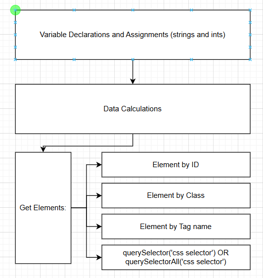

# Script Design
## Script Idea
My idea for adding JavaScript implementation to my site is to add some more information to the Rankings page, specifically on the players that have been ranked multiple times. It will feature character info, win rates, how many times they've appeared on the site, etc. I think to start I will just add information in some basic paragraphs and headers, but eventually I would like to enhance these with more interactive elements like images.

## Goals
These additions will enhance user expirience by allowing users to gain more information on the ranked players here in RI. I feel like the rankings page, while fun to look at, lacks cohesive information about the overall feel of the scene. 

## Task Breakdown
Break down the process into smaller tasks that your script will need to perform. Think through each step, from capturing user input to displaying the final output on the site.
First I will declare the variables I need for each player I'm going to give a spotlight to (probably just the 5 on the current ranking), and list out information like main character, win rate, average placement on the rankings, and other fun statistics. Next, I will change up the rankings.html file to make room for these new sections. Next, I will get these fields from the .html file in the .js file in order to give it the information we need.

## Flowchart

